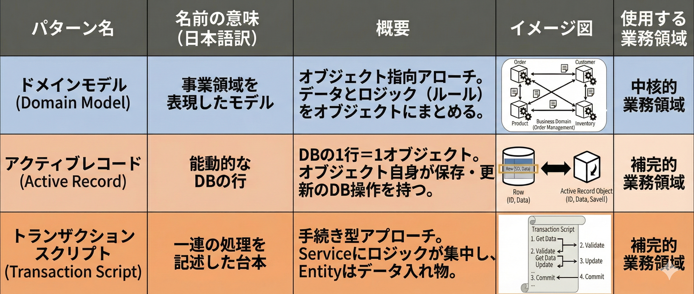
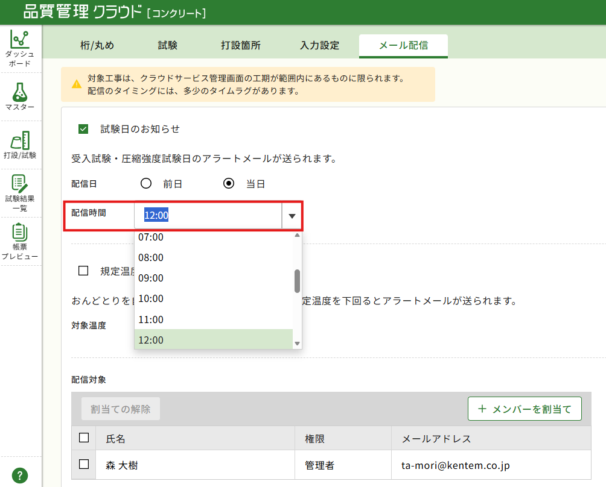
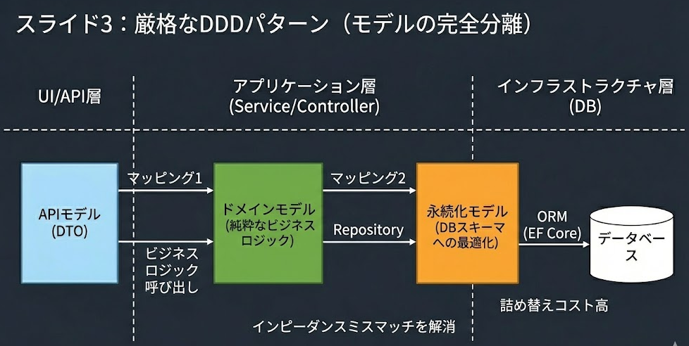
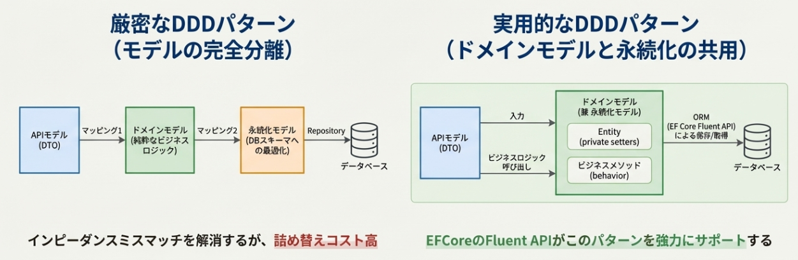

# EFCoreで実践するドメインモデル
～Fluent APIを上手く使って値オブジェクトの実践をしたい（願望）編～
<div class="columns">
<div class="large">

### 振り返り
- **複雑**で他社との**差別化**につながる領域 <br>= **中核的業務領域**においては、<br>**ドメインモデル**という設計パターンが推奨
- 業務ロジックがシンプルな領域<br>= **補完的業務領域**においては、<br>**トランザクションスクリプト**も許容される
- **中核的業務領域**にもかかわらず、EFCoreでトランザクションスクリプトをやるのは、**貧血ドメインモデル**と呼ばれる<br>**アンチパターン**である

</div>
<div >

   
  

</div>
</div>

---
# TechConfにて「シン：なぜ我々はEFCoreを使うのか」
## ご好評の声いただき本当にありがとうございました！
皆様のお声
- もっと長く聞きたかった。
- 実践例のPRが見たい
- **EFCoreの話あんまりしてなくない？**

# はい、タイトル詐欺でした。すみません・・・

--- 

# 実際にやってみた

<div class="columns" >
<div>

## 「配信時間」という**値**について
## **１時間単位でしか設定できない**というルールを値オブジェクトで表現してみたい

### ※プルリクエスト公開中

</div>
<div class="midium">



</div>
</div>

---
# ①PUTに定義されたValidationを削除する
staticで定義されたValidationロジックは**低凝集**を引き起こし、**呼び忘れのリスク**がある

``` csharp
public static AlertMailSettingModel Put(QualityControlDbContext context, Guid kojiId, AlertMailSettingProperties properties)
{
    var normalizedRecipients = (properties.RecipientUserIds ?? []).Distinct().OrderBy(id => id).ToArray();

    // ValidateInput(properties); 消す

    TestScheduleAlertSettingHelper.Put(context, kojiId, properties.TestSchedule ?? new());
    TemperatureAlertSettingHelper.Put(context, kojiId, properties.Temperature ?? new());
    MailRecipientSyncPut(context, kojiId, normalizedRecipients);

    return properties.ToModel(kojiId, normalizedRecipients);
}
```

---
# ②値オブジェクトにルールをカプセル化する
``` csharp
public readonly record struct TestScheduleAlertSendTime
{
    public TimeSpan Value { get; }

    /// コンストラクタは直公開しない
    private TestScheduleAlertSendTime(TimeSpan value)
    {
        Validate(value);
        Value = value;
    }

    /// 公開するファクトリメソッド
    public static TestScheduleAlertSendTime From(TimeSpan value) => new(value);

    /// <summary>
    /// 1時間刻み（分秒が0）であることを検証します。
    /// </summary>
    public static void Validate(TimeSpan value)
    {
        // 既存仕様：分秒は0固定（1時間刻みのみ許可）
        if (value.Minutes != 0 || value.Seconds != 0)
            throw new InvalidDataException($"試験日アラートメールの配信時間（{value}）は1時間間隔で入力してください。");
    }
}

```
---
# ③プリミティブ型を値オブジェクトに書き換える
``` csharp
/// <summary>試験予定アラート設定明細</summary>
[Table(nameof(TestScheduleAlertSettingDetail))]
public class TestScheduleAlertSettingDetail : EditableBase
{
    /// <summary>明細ID</summary>
    [Key]
    public Guid Id { get; set; }

    ・・・

    // <summary>配信時間</summary>
    // [Column(TypeName = "time")] 
    // public TimeSpan SendTime { get; set; } = TimeSpan.Zero; 

    /// <summary>配信時間</summary>
    public TestScheduleAlertSendTime SendTime { get; set; } = TestScheduleAlertSendTime.From(TimeSpan.Zero);

}
```

---
# ④Fluent APIで値とオブジェクトを結びつける

``` csharp
modelBuilder.Entity<TestScheduleAlertSettingDetail>()
    .Property(q => q.SendTime)
    .HasConversion(
        new ValueConverter<TestScheduleAlertSendTime, TimeSpan>(
            v => v.Value,
            v => TestScheduleAlertSendTime.From(v)))
    .HasColumnType("time");
```
あれ…TechConfでは**ComplexType**って言ってなかった…？

# すみません、単一プロパティの値オブジェクトの場合<br>**ComplexType**より**HasConversion**の方が適切でした

---

# ComplexType vs HasConversion
## ComplexType
- **複数のプロパティ**を持つ値オブジェクトをテーブルにフラットに結びつけるとき
    - 例：住所、氏名など
- 内部のプロパティを**KeyやIndexとして利用ができない** ←かなりきつい
- 複数（コレクション）をサポートしていない　←**後述**
- 全体Nullがサポートされていない（プロパティの一部NullはEFCore10でサポート）

## **HasConversion**
- **単一のプロパティ**を値オブジェクトにするとき
- KeyやIndexとして利用**可能**

---
## ComplexTypeは内部プロパティを**KeyやIndexとして利用できない**
先ほどの例は、インデックスが張られていたのでHasConversionにすることが必須でした。
``` csharp
modelBuilder.Entity<TestScheduleAlertSettingDetail>()
    .HasIndex(q => new { q.KojiId, q.SendTime })
    .HasDatabaseName("IX_TestScheduleAlertSettingDetail_KojiId_SendTime");

modelBuilder.Entity<TestScheduleAlertSettingDetail>()
    .Property(q => q.SendTime)
    .HasConversion(
        new ValueConverter<TestScheduleAlertSendTime, TimeSpan>(
            v => v.Value,
            v => TestScheduleAlertSendTime.From(v)))
    .HasColumnType("time");
```

---
## ComplexTypeがコレクションをサポートしていない問題
そもそも、**複数あるのに区別しなくてよいのか**（ID不要でよいか）
IDがあるなら値オブジェクトではなく、**エンティティ**

|値オブジェクト|↔|エンティティ|
|----|-|----|
|不変|↔|可変|
|IDが無い|↔|IDがある|
- 値オブジェクトは、**値が一緒であれば、同じものである**とみなす
- エンティティの一部として値オブジェクトがある
    - Complex TypesがListをサポートしていないことについて困った場合、
    それは値オブジェクトではなく、エンティティかも

--- 


## OwnsManyを利用して、**中間テーブルを値オブジェクトとみなす**

どうしても値オブジェクトのリストを持つべきだと思われるとき
- コレクションの中身が**重複せず**、**値が同じなら同じものであるとみなせる**もの
    - 例）中間テーブルを介してマスタテーブルを参照する
    - 例）キーだけを保持し、外部サービスに問い合わせを行うもの
- 具体的には、記事に対するタグ、エンジニアに対する資格一覧、外部サービスで管理される社員ID一覧など
    - 「エンジニア」が持つ「資格」の例
    - IDという値を持つ値オブジェクトだと考えられる

---

<div class="columns" >
<div class="midium">

エンティティ
```csharp
public readonly record struct QualificationId(string Value);

public sealed class Engineer
{
    public Guid Id { get; private set; }

    private readonly List<EngineerQualification> _qualifications = new();
    public IReadOnlyCollection<EngineerQualification> Qualifications => _qualifications;

    private Engineer() { } // EF

    public Engineer(Guid id) => Id = id;

    public void AddQualification(QualificationId qualificationId)
    {
        if (_qualifications.Any(x => x.QualificationId == qualificationId)) return;
        _qualifications.Add(new EngineerQualification(qualificationId));
    }

    public void RemoveQualification(QualificationId qualificationId)
        => _qualifications.RemoveAll(x => x.QualificationId == qualificationId);
}
```

紐づきを表現する値オブジェクト

``` csharp
// “エンジニアと資格の紐づき”だけを表す値オブジェクト（追加情報なしの中間テーブル）
public sealed record class EngineerQualification
{
    public QualificationId QualificationId { get; private set; }

    private EngineerQualification() { } // EF
    public EngineerQualification(QualificationId qualificationId) => QualificationId = qualificationId;
}

// 資格情報マスタ
public sealed class QualificationMaster
{
    public string Id { get; private set; } = default!; // 例: "基本情報", "応用情報"
    public string Name { get; private set; } = default!;
}

```

</div>
<div class="midium">
    
DbContextの定義

```csharp
using Microsoft.EntityFrameworkCore;

protected override void OnModelCreating(ModelBuilder modelBuilder)
{
    modelBuilder.Entity<Engineer>(b =>
    {
        b.HasKey(x => x.Id);

        b.OwnsMany(x => x.Qualifications, q =>
        {
            q.ToTable("EngineerQualifications");      // ← 中間テーブル
            q.WithOwner().HasForeignKey("EngineerId");

            // 値オブジェクトの中身を1列にマップ
            q.OwnsOne(x => x.QualificationId, id =>
            {
                id.Property(p => p.Value)
                    .HasColumnName("QualificationId")
                    .IsRequired();
            });

            // 中間テーブルなので複合キーにする（永続化上のキーであって、ドメインIDではない）
            q.HasKey("EngineerId", "QualificationId");

            // 同一エンジニア内での重複防止にもなる
        });
    });

    modelBuilder.Entity<QualificationMaster>(b =>
    {
        b.ToTable("QualificationMasters");
        b.HasKey(x => x.Id);
    });
}

```
</div>
</div>

---

# ところで何をしてるんだっけ？
EFCoreが提供する、**HasConversion/ComplexType/OwnsMany**といった機能を利用し
DBスキーマでもあるエンティティに**そのまま**振る舞いを持たせ
**ドメインモデル化**する手法を模索

---

# ３つの世界
<div class="columns-rightlarge" >
<div>

### ・APIモデル
公開するインターフェース
### ・ドメインモデル
不変条件をカプセル化
### ・永続化モデル
DBのスキーマ

</div>
<div>


</div>
</div>

### ドメインの純粋さを求めると、モデルが３つ必要になり、管理コストが膨らむ

---

# FluentAPIが何をやってくれているか

### 値オブジェクトを内包する**ドメインモデル**を、<br>**永続化モデル**としてそのまま利用するための各種機能をサポート



---

# まとめ
EFCoreを利用することで、
- ドメインモデルと永続化モデルを共有できる
- それにより、２重定義やマッピングを減らすことができる
- FluentAPIの各種メソッドを上手く利用して、DBの都合を記述できる
    - HasConversion:単一のプロパティを持つ値オブジェクト
    - ComplexType：複数のプロパティを持つ値オブジェクト
    - OwnsMany:エンティティに複数所有される値オブジェクト