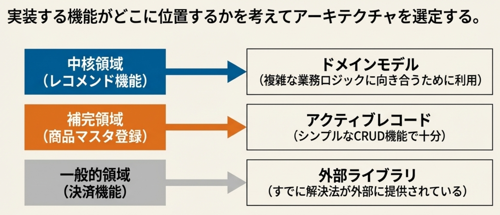

# 事業的優位性の源泉

新規事業を立ち上げるとして、どちらが長期的に儲かりそうか、考えてみてください

1. 単純な業務課題を解決する 
2. 複雑な業務課題を解決する

- 我々が扱うビジネス（業務領域）は往々にして複雑である
    - シンプルな（複雑ではない）課題は参入障壁が低かったり、そもそも解決するまでも無かったりする
    - 困難を解決するからこそ、ビジネス（お金を払ってやってもらいたい）になる

---
# 事業的優位性の源泉
新規事業を立ち上げるとして、どちらが長期的に儲かりそうか、考えてみてください

1. 良く知られた方法で解決できる 
2. 他社とは違う新しい方法でしか解決できない

- 自社で開発する以上は、他に解決できる一般化される方法がないと言える
    - つまり、他社と比較した際の差別化要因が必要

---

## 業務特有の知見とシステムの価値
例えば、コンクリートに関する業務知識
- 「工場で練り混ぜられてから120分以内に打設されなければならない」
- ただし、「気温が25度を超える場合は90分以内に打設しなければならない」
- 「コンクリートを現場で配合する場合、午前中と午後で表面水量を計測し、
単位水量を規定量内に保たなければならない」

業務に固有で、複雑になりがち
→ これをシステムで管理・計算して価値（面倒ごとの解決）として提供する
- 業務ロジックこそ、システムが提供する価値そのものである

--- 

# 本質的複雑性に向き合う

- 独特で複雑な業務ロジックに、自ら向き合うとき、それ以上の複雑性を持ち込みたくない
    - 例えば、永続化（RDB）の都合
    - 例えば、View（公開するAPI）の都合
- フレームワークに依存しない純粋なオブジェクト（POCO）で、業務ロジックのみを記述したい
    - 例えば、RDBやViewなど存在せず、すべてがメモリ上で実現できると考えてください
    - あなたは受け取った情報に対して、どのような業務のルールを実現するか
    ＝業務ロジック **だけ**に集中できます
- このような考えこそ、**ドメイン駆動設計**の**戦略**の始まりです

---

# ドメイン駆動設計の戦略

- 業務ロジックの複雑さ、競合他社との差別化　の2軸のマトリクスで区分分けする
    - 一般的な業務領域
    - 補完的な業務領域
    - 一般または補完的な業務領域
    - 中核の業務領域


---
# 業務領域の特徴をつかむ　練習問題①

<div class="columns" >
<div class="midium">

### この業務はどの領域か

- Q1-1：あなたは高級料理店の支配人です。
マトリクスの中に業務を振り分けてください
    - 食材の下ごしらえ
    - 複雑な給与計算　
    - 創造的なレシピ開発

### この業務は誰がやるか
- Q1-2：それぞれの業務領域について、
あなたはどんなリソースで解決しますか？
    - 見習いの新人
    - 外部の人材（税理士）
    - エース料理長

</div>
<div >


</div>
</div>

---

- 独特だがシンプルな作業は、自社の低コスト人材の教育の機会とする
- 複雑な領域に自社の高コストなリソースを振り分けるべき
- 複雑だが一般的な課題は外部に解決策がある


---
# 業務領域の特徴をつかむ　練習問題②

<div class="columns" >
<div class="midium">

### この機能はどの領域か
- Q2-1：あなたはECサイトAppのアーキテクトです。
以下の業務をマトリクスの中に振り分けてください
    - 商品マスタの登録機能
    - 顧客の趣向に合わせた商品のレコメンド機能
    - 決済機能

### この機能をどんなリソースで解決するか

- Q2-2：それぞれの業務領域について、
あなたはどんなリソースで解決しますか？
    - 若手の新人
    - エースエンジニア
    - 外部ライブラリ
    - 
</div>
<div >


</div>
</div>

---

# アーキテクチャの位置付け

## トランザクションスクリプト

1. トランザクションスクリプト：
エンドポイント～永続化までを**すべて手続き的**に記述する
2. アクティブレコード：
１レコードを１オブジェクトとして表現し、SQLを内部に隠蔽する

- トランザクションスクリプト（もしくはアクティブレコード）で
業務ロジックを実装すると外部の複雑さが持ち込まれる
- 主に永続化の都合が持ち込まれる

というか、**永続化こそがBEの責務**だという意識で実装される

---

# ドメインモデル

### 値オブジェクト、エンティティ、（そして集約）といった
ドメインモデルを構成する部品  を用いて
# 業務を**モデル化**する

---

## モデル化って何？


---

### Q　なぜモデル化するのか
# A　役に立つ形を模索するため

---


--- 

## ドメインモデルの良さ

ドメインモデルでは業務をモデル化してPOCOで業務ロジックを記述する
  - モデル化する過程で、
  - POCO：**Plain-Old C# Object** 
  フレームワークやRDBに依存しない**素の**C#オブジェクト
  - POCOで業務ロジックを実現できれば、**業務ロジックだけに集中**できる

--- 

実装する機能がどこに位置するかを考えてアーキテクチャを選定する
→これがドメイン駆動開発の戦略


---
## アーキテクチャの戦略的選択



---

### アーキテクチャの戦略的選択
- 補完的な領域では、業務ルールがシンプルなので、
アクティブレコード（トランザクションスクリプト）で十分
    - ただし、機能開発を繰り返すうちに、複雑になってきたら注意
    - 補完的業務領域が、中核的業務領域に成長することもある
- ドメインモデルはコストが高いため、
# **中核的な業務領域**で<br>**複雑さに向き合う**ときにのみ利用する

---

<div class="columns" >
<div class="midium">

# よく見る実装

## テーブル定義を行うエンティティ

``` csharp
public class ConcretePlacement
{
    public int Id { get; set; }

    public DateTime DeliveryTime { get; set; }
    public DateTime PlacementTime { get; set; }
    public decimal Volume { get; set; }
}
```


</div>
<div>

**Controller**また**Service**から呼ばれるクラス
``` csharp
public static class ConcretePlacementHelper
{
    public static void Post(
        ConcretePlacementDto dto,
        ConcreteDbContext db)
    {
        Validate(dto);

        EnsureWithinAllowedTime(dto);

        var entity = new ConcretePlacement
        {
            DeliveryTime = dto.DeliveryTime,
            PlacementTime = dto.PlacementTime,
            Volume = dto.Volume
        };

        db.ConcretePlacements.Add(entity);
        db.SaveChanges();
    }

    // RESTの公開メソッド群
    // PUT GET など

    // ---- 以下、ドメインロジック ----

    private static void Validate(ConcretePlacementDto dto)
    {
        if (dto.Volume <= 0)
        {
            throw new InvalidOperationException("数量は正の値である必要があります");
        }
    }

    private static void EnsureWithinAllowedTime(ConcretePlacementDto dto)
    {
        var duration = dto.PlacementTime - dto.DeliveryTime;

        if (duration > TimeSpan.FromHours(2))
        {
            throw new InvalidOperationException("打設時間超過です");
        }
    }
}
```
--- 
<div class="columns" >
<div>
<br>
<br>
<br>

# これ、<br>**アンチパターン**です

# **貧血**ドメインモデル
``` csharp
public class ConcretePlacement
{
    public int Id { get; set; }

    public DateTime DeliveryTime { get; set; }
    public DateTime PlacementTime { get; set; }
    public decimal Volume { get; set; }
}
```

</div><div>


</div>
</div>

--- 

<div class="columns" >
<div class="midium">

# 貧血ドメインモデル

# **振る舞い**を持たないエンティティ

``` csharp
public class ConcretePlacement
{
    public int Id { get; set; }

    public DateTime DeliveryTime { get; set; }
    public DateTime PlacementTime { get; set; }
    public decimal Volume { get; set; }
}
```
- 振る舞いを持たないので処理が手続き的
- 業務ロジックとDBの処理が密結合している
  


</div>
<div>

``` csharp
public static class ConcretePlacementHelper
{
    public static void Post(
        ConcretePlacementDto dto,
        ConcreteDbContext db)
    {
        Validate(dto);

        EnsureWithinAllowedTime(dto);

        var entity = new ConcretePlacement
        {
            DeliveryTime = dto.DeliveryTime,
            PlacementTime = dto.PlacementTime,
            Volume = dto.Volume
        };

        db.ConcretePlacements.Add(entity);
        db.SaveChanges();
    }

    // RESTの公開メソッド群
    // PUT GET など

    // ---- 以下、ドメインロジック ----

    private static void Validate(ConcretePlacementDto dto)
    {
        if (dto.Volume <= 0)
        {
            throw new InvalidOperationException("数量は正の値である必要があります");
        }
    }

    private static void EnsureWithinAllowedTime(ConcretePlacementDto dto)
    {
        var duration = dto.PlacementTime - dto.DeliveryTime;

        if (duration > TimeSpan.FromHours(2))
        {
            throw new InvalidOperationException("打設時間超過です");
        }
    }
}
```

</div>
</div>

