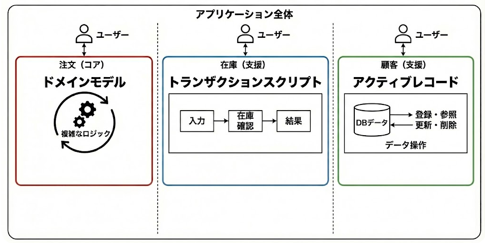

# ドメインモデルについての率直な感想
- ファイルが増えて追いずらそう、めんどい、やったことない、
- 学習コストがかかる・・・
- モデルに対する哲学的議論より手を動かしたい

---

## ドメインモデルは**どこでも使えばいいってものではない**
ただしアーキテクチャの選択について理由を明確にするべき
- 複雑な独自の知見がある業務領域で、
トランザクションスクリプトやアクティブレコードを使っていないか？
- 難しい機能だからと言って、技術力がある人材を割り当てていないか？
　（マネージドなサービスやライブラリの検討）

 逆に、すでに巨大な泥団子に陥っているなら、その領域は中核の業務領域かもしれません。

---

## 事業戦略に基づく設計判断
- 同じ（モノリス）アプリケーション内で、
明確に異なる事業領域機能(モジュール化された機能)ごとに変えてもよい

- CQRS観点でQuery（読み取り側）だけトランザクションスクリプトにしてもよい

---
## ドメインモデルをいつやるか
- 今その必要がないからと言って、ずっとその必要がないとは限りません
  

---

# プロのキッチンを整える

### 業務ロジックが凝集され、カオスにならないコードベース
  - 美しいまな板のようなもの
### 業務エキスパートと深く相互理解された洗練されたユビキタス言語
### それらが生み出す役に立つ（業務ロジックを雄弁に語ることができる）モデル
  - 切れ味のいい包丁のようなもの

# これらが整うことで、いつでも新しく魅力的な料理（機能）を産み出すことができる

--- 
# 貧血ドメインモデル
- ただEFCoreを使うだけだと、
モデルは振る舞いを持たず、処理が手続き的で業務知識を表現しない
- 最初はシンプルな機能でも、改修を繰り返すうちに、徐々にコードが汚れる
  
### 汚れたまな板とさびた包丁で料理するようなことになっていく
  - どんなに料理人（エンジニア）の腕が良くても、
  スピード（生産性）が落ち、
  出来上がる料理（機能）の品質は低下する

---

# まとめ

- **自己文書化**された、業務知識を雄弁に語るコードにより
    - 辛い仕事を回避し、スピーディーな開発生産性を**維持**できる
- **中核的領域**で**業務そのものの複雑さに向き合う**ときに**ドメインモデル**を実践する
    - 模倣困難性の高い機能（価値）を産み出すために、中核的領域に注力する
- **ドメインモデル**の実践により、POCOで**業務ロジック**を記述することに集中できる
    - 永続化ではなく、**業務ロジックこそがアプリケーション**である
- EFCoreを利用しているのは、DBの情報を**オブジェクト**として表現し、
  - さらに**値オブジェクト**などを利用して**モデルに振る舞い**を持たせ、
  複雑さに向き合うための**役に立つモデル**を磨いていくためである
## まずは、**値オブジェクト**を使っていこう