# “シン”我々はなぜEFCoreを使うのか 
～ドメイン駆動設計とEFCoreから考える値オブジェクトのすゝめ～

<div class="columns">
<div>

### この番組は、ご覧の本の影響で、<br>お送りいたします。
    

</div>
<div class="large">

### 振り返り
- EFCoreを利用するのはDB中心から<br>**オブジェクト中心**への移行が目的
- オブジェクト中心にすることで、<br>より複雑なエンティティの関係性を記述しやすくなる
- しかし、さらに複雑な**業務ロジック**が存在するプロダクトでは、エンティティ同士の関係をオブジェクトとして記述するだけでは不十分である
</div>
</div>

---

# メロスは激怒した、
## 必ず、かの邪知暴虐の**貧血ドメインモデル**を除かねばならなぬと決意した。
メロスにはCI/CDが分からぬ、モダンなフロントエンドも、機械学習もわからぬ。
メロスは、SES村のIT土方である。Excelでテスト設計書を書き、E2Eテストの結果をスクリーンショットし、DBダンプをExcelに添付して暮らしてきた。
# けれども、**スパゲッティコードに向かう匂い**に対しては、人一番に敏感であった。

---

# 自己紹介
## 森 大樹 （もり　たいき）
施工管理クラウド①　品質管理クラウド[コンクリート]　福岡オフィス
### 経歴
- 新卒で人材派遣の営業：２年半（2020年4月～2022年9月） 
- SESで3つの現場を経験：２年半（2022年10月～2025年4月）
言語：Javaメイン　/　フレームワーク：Spring・Seaser2 Backbone.jsなど
- KENTEMに入社：2025年5月～
BEエンジニア

---

# 楽しい仕事・つらい仕事
- 皆さんは、コードを書いているときと、ドキュメントを整理しているとき、
どっちが楽しいですか？
- 以下のような仕事をしたいと思いますか？
  
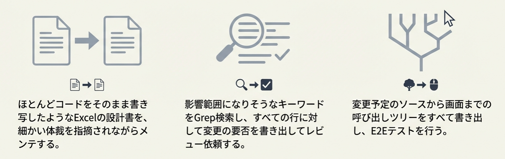

---
<div class="columns">
<div class="center">
<br>
<br>
<br>
<br>
やりたくないですよね？<br>
でも、前職では<br>
つらい仕事ばっかりさせらたので・・・
</div>
<div>


</div>
</div>

--- 
<div class="columns">
<div>

KENTEMにやってきて…

</div>
<div>

### もう一つは…


レガシーコードに親しんだ私だからこそ
嫌な未来が想像されるときがあります

</div>
</div>

--- 

## なぜ面倒な仕事が生まれたか

事業的に成功し、長期に稼働し続けるシステムのコード
　≒レガシーコードの現場では、たいてい面倒な仕事がつきもの
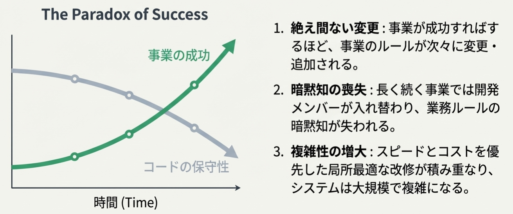

--- 

# どのように面倒な仕事を回避できそうか


---

<div class="midium">

### 課題①：複雑化した（そして名無しの）業務ロジックをコードから読み取ろうとすると認知負荷が高い<br>→仕様のドキュメント化（Wikiや設計書）へ逃げる
# 対策①：ビジネスの知識を（ドキュメントではなく）コードで雄弁に表現する
  - ドキュメントやコード内コメントはメンテナンスコストが高く、劣化コピーになりがち。
  - コードこそが仕様を表現する唯一の真実です。
</div>

### BAD

```csharp
// 120って何？単位は？何の制約？
if ((placedAt - shippedAt) > 120) throw new Exception("NG");
```

### GOOD

```csharp
// 配送時間クラスのファクトリメソッド内でチェック
var time = TransportTime.From(shippedAt, placedAt); // 120分超ならここで失敗（仕様が型にある）
// 必ず正しい状態のオブジェクトが生成される
```


--- 

### 課題②：業務ロジックが凝集せず、あちこちに散らばっている<br>→変更箇所の漏れが多発し、力業でマネジメントするしかなくなる

# 対策②：業務のルールを凝集させ、カプセル化する
- 一つのルールは一つの個所にだけ実装すればよいようにする
- それ以外の場所からは触らせないように守る

<div class="columns">
<div class="midium">

### BAD

```csharp
// API POST: 120分チェック
if ((placedAt - shippedAt) > 120) return BadRequest();
・・・

// API PUT: 120分チェック
if ((placedAt - shippedAt) > 120) return BadRequest();
・・・

// Batch: 120分チェック
status = (placedAt - shippedAt) <= 120 ? "OK" : "NG";
・・・
```
</div>
<div class="midium">

### GOOD

```csharp
// どのAPIでもBatchでも、TransportTime型を利用する時点でチェックが適用される
var time = TransportTime.From(shippedAt, placedAt);
```
</div>
</div>

---

### 課題③：業務の本質を理解せず、場当たり的な実装を行ったためにロジックがカオス化する<br>→変更の副作用を担保するために、すべての流れをトレースする必要がある

# 対策③：偶発的複雑性を排除し、本質的複雑さにのみフォーカスする
1. **偶発的**複雑性：コードの都合で生まれる複雑性
    - フレームワークの都合が入り込んで複雑になる、通信の都合で複雑になる
    説明が十分でない命名のせいで複雑になる
    - システムの価値に影響しない複雑性です
    
2. **本質的**複雑性：システム化の対象とする業務ルールがそもそも複雑
    - こちらは仕方のないこと（というかシステムの提供する価値そのもの）です

---
### 課題③：業務の本質を理解せず、場当たり的な実装を行ったためにロジックがカオス化する

<div class="columns" >
<div class="lagrge">

### Bad

業務ロジックを手続き的に記述する

```csharp
public async Task PlaceAsync(Guid id, DateTime placedAt)
{
    var e = await db.Deliveries.FindAsync(id);

    // DB列（int）を直接いじる＝“仕様”がどこにもいない
    e.TransportMinutes = (int)(placedAt - e.ShippedAt).TotalMinutes;

    // あちこちにifが増える（例外条件が増えるたびに追記）
    if (e.TransportMinutes > 120 && e.CustomerCode != "A") throw new Exception("NG");

    await db.SaveChangesAsync();
}
```
</div>
<div class="lagrge">

### Good

対象となる業務をモデル化する

```csharp
public class ConcreteDelivery
{
    public Guid Id { get; private set; }
    public DateTime ShippedAt { get; private set; }
    public TransportTime TransportTime { get; private set; } = default!;

    private ConcreteDelivery() { } // EF用

    public ConcreteDelivery(Guid id, DateTime shippedAt)
    {
        Id = id;
        ShippedAt = shippedAt;
    }

    public void MarkPlaced(DateTime placedAt)
        => TransportTime = TransportTime.From(ShippedAt, placedAt); // 不正なら生成できない
}
```
``` csharp
// DbContext
modelBuilder.Entity<ConcreteDelivery>()
    .ComplexProperty(x => x.TransportTime, ct =>
        ct.Property(p => p.Minutes).HasColumnName("TransportMinutes"));
```
</div></div>


---

## つまり・・・？

# 将来の自分たちのために<br>**自己文書化**されたコードになるように**設計**しよう
というモチベーションが湧いてきます（動けばいいわけではない）

　湧いてきましたよね？その体で進めていきます。

---

そのために必要な考え方こそ **ドメイン駆動設計**です
# ドメイン駆動設計 とは
# **事業価値から逆算して、設計判断を行う**ための<br>体系的知見

---

# 事業的優位性の源泉

新規事業を立ち上げるとして、どちらが長期的に儲かりそうか、考えてみてください

1. 単純な業務課題を解決する 
2. 複雑な業務課題を解決する

- 我々が扱うビジネス（業務領域）は往々にして複雑である
    - シンプルな（複雑ではない）課題は参入障壁が低かったり、そもそも解決するまでも無かったりする
    - 困難を解決するからこそ、ビジネス（お金を払ってやってもらいたい）になる

---
# 事業的優位性の源泉
新規事業を立ち上げるとして、どちらが長期的に儲かりそうか、考えてみてください

1. 良く知られた方法で解決できる 
2. 他社とは違う新しい方法でしか解決できない

- 自社で開発する以上は、他に解決できる一般化される方法がないと言える
    - つまり、他社と比較した際の差別化要因が必要

---

## 事業的優位性の源泉
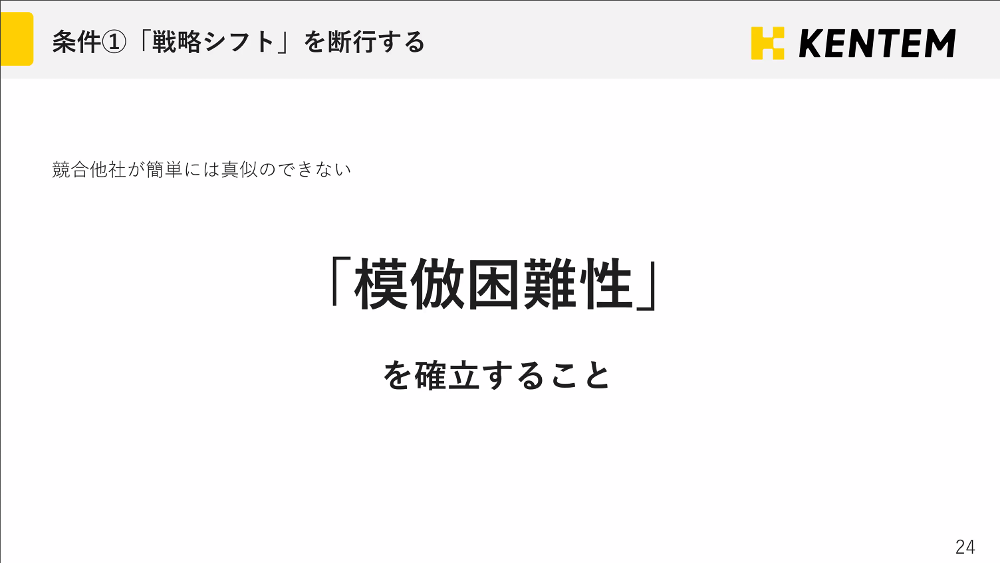

---

# ドメイン駆動設計の戦略

- 業務ロジックの**複雑さ**、競合他社との**差別化**
の2軸のマトリクスで区分分けする


---

# 業務領域の特徴をつかむ　練習問題①

<div class="columns" >
<div class="midium">

## この業務はどの領域か

- Q1-1：あなたは高級料理店の支配人です。
**中核的**業務領域に当てはまるのはどれ？
    - A：食材の下ごしらえ
    - B：複雑な給与計算　
    - C：創造的なレシピ開発

## この業務は誰がやるか
- Q1-2：**中核的**業務領域について、
あなたはどんなリソースで解決しますか？
    - A：見習いの新人
    - B：外部の人材（税理士）
    - C：エース料理長

</div>
<div >


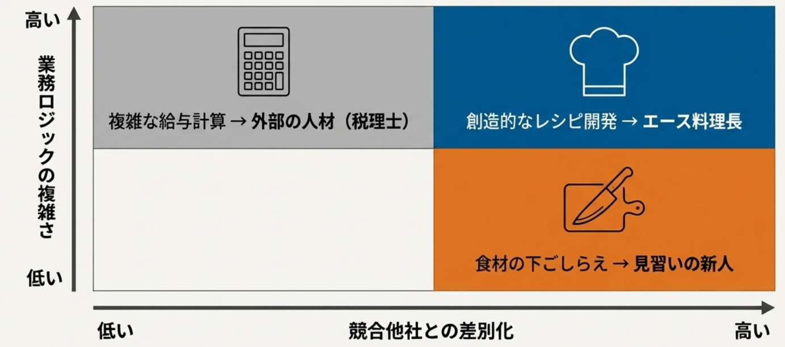
</div>
</div>

---

- 独特だがシンプルな作業は、自社の人材の教育の機会とする
- 複雑な領域に自社の高コストなリソースを振り分けるべき
- 複雑だが一般的な課題は外部に解決策がある


---
# 業務領域の特徴をつかむ　練習問題②

<div class="columns" >
<div class="midium">

## この機能はどの領域か
- Q2-1：あなたはECサイトAppのアーキテクトです。
**補完的**業務領域に当たりそうなのはどれ？
    - A：商品マスタの登録機能
    - B：顧客の趣向に合わせた商品のレコメンド機能
    - C：決済機能

## この機能をどんなリソースで解決するか

- Q2-2：**補完的**業務領域について、
あなたはどんなリソースで解決しますか？
    - A：若手の新人
    - B：エースエンジニア
    - C：外部ライブラリ

</div>
<div >

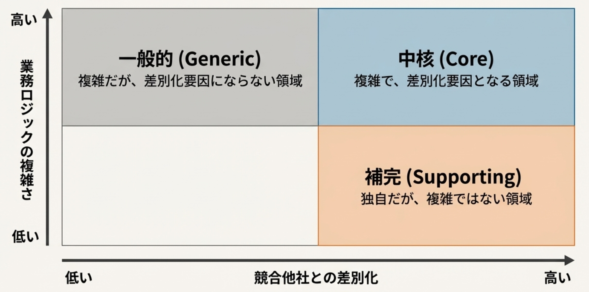

</div>
</div>

---

# 中核的業務領域に向き合う

## 複雑で差別化要因になる業務領域とは？
例えば、コンクリートに関する業務知識
- 「工場で練り混ぜられてから120分以内に打設されなければならない」
- ただし、「気温が25度を超える場合は90分以内に打設しなければならない」
- 「コンクリートを現場で配合する場合、午前中と午後で表面水量を計測し、
単位水量を規定量内に保たなければならない」

### 業務に固有で、複雑になりがち<br>→ これをシステムで管理・計算して**価値**（面倒ごとの解決）として提供する

---

# **本質的**複雑性に向き合う
<div class="columns" >
<div>

###  本質的複雑性
- 業務領域そのものの複雑性
  - システムの価値そのもの
### 偶発的複雑性
- システム都合の複雑性
  - 永続化（RDB）の都合
  - View（公開するAPI）の都合

## **ドメインモデル**の**戦略**<br>→ 本質的複雑性のみに注力する

</div>
<div>

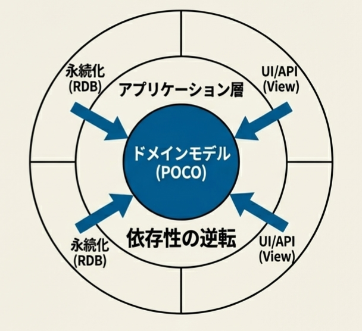
</div>

---

### ３つのアーキテクチャの特徴


---

# ドメインモデル

ドメインモデルは、本質的複雑性に向き合うためにどうするか？
### 値オブジェクト、エンティティ、（そして集約）といった
ドメインモデルを構成する部品  を用いて
# 業務領域を**モデル化**する

---

## モデル化って何？
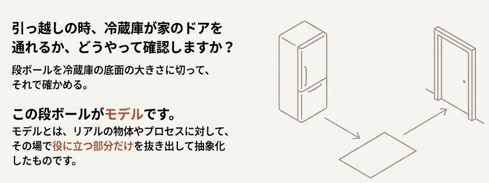

---


--- 

# オブジェクト指向言語におけるモデル
<div class="columns">
<div>

**モデル**は、**POCO**でなければなりません

## POCO：**Plain-Old C# Object** 
### フレームワークやRDBに依存しない<br>**素の**C#オブジェクト
- POCOで業務ロジックを実現できれば、**業務ロジックだけに集中**できる
- 依存性逆転（DI）を用いて、
偶発的複雑性を外部に排する

</div>
<div>


</div>
</div>

---

# アーキテクチャの戦略的選択
ドメインモデルはコストが高いため、
# **中核的な業務領域**で<br>**複雑さに向き合う**ときにのみ利用する

### 補完的な業務領域では、業務ルールがシンプルなので、手続き的な実装で十分
- アクティブレコード または **トランザクションスクリプト**を選択する

## 複雑な業務領域でトランザクションスクリプトを使うと<br>**スパゲッティコード**になる

---

<div class="columns" >
<div class="midium">

# 我々の実装はどこに位置する？
### よく見る実装
## テーブル定義を行うエンティティ

``` csharp
public class ConcretePlacement
{
    public int Id { get; set; }

    public DateTime DeliveryTime { get; set; }
    public DateTime PlacementTime { get; set; }
    public decimal Volume { get; set; }
}
```


</div>
<div>

**Controller**また**Service**から呼ばれるクラス
``` csharp
public static class ConcretePlacementHelper
{
    public static void Post(
        ConcretePlacementDto dto,
        ConcreteDbContext db)
    {
        Validate(dto);

        EnsureWithinAllowedTime(dto);

        var entity = new ConcretePlacement
        {
            DeliveryTime = dto.DeliveryTime,
            PlacementTime = dto.PlacementTime,
            Volume = dto.Volume
        };

        db.ConcretePlacements.Add(entity);
        db.SaveChanges();
    }

    // RESTの公開メソッド群
    // PUT GET など

    // ---- 以下、ドメインロジック ----

    private static void Validate(ConcretePlacementDto dto)
    {
        if (dto.Volume <= 0)
        {
            throw new InvalidOperationException("数量は正の値である必要があります");
        }
    }

    private static void EnsureWithinAllowedTime(ConcretePlacementDto dto)
    {
        var duration = dto.PlacementTime - dto.DeliveryTime;

        if (duration > TimeSpan.FromHours(2))
        {
            throw new InvalidOperationException("打設時間超過です");
        }
    }
}
```
--- 
<div class="columns" >
<div>
<br>

# これ、<br>**貧血**ドメインモデル<span class="small">と呼ばれる</span><br>**アンチパターン**です


``` csharp
public class ConcretePlacement
{
    public int Id { get; set; }

    public DateTime DeliveryTime { get; set; }
    public DateTime PlacementTime { get; set; }
    public decimal Volume { get; set; }
}
```

</div><div>


</div>
</div>

--- 

<div class="columns" >
<div class="midium">

# 貧血ドメインモデル

# **振る舞い**を持たないエンティティ

``` csharp
public class ConcretePlacement
{
    public int Id { get; set; }

    public DateTime DeliveryTime { get; set; }
    public DateTime PlacementTime { get; set; }
    public decimal Volume { get; set; }
}
```
- レコードをオブジェクトにしてはいるが、
**手続き的処理**を抜け出せていない
- モデルは**貧血**・処理は**トランザクションスクリプト**

</div>
<div class="small">

### トランザクションスクリプトでは、**複雑さ**に向き合えない
``` csharp
public static class ConcretePlacementHelper
{
    public static void Post(
        ConcretePlacementDto dto,
        ConcreteDbContext db)
    {
        Validate(dto);

        EnsureWithinAllowedTime(dto);

        var entity = new ConcretePlacement
        {
            DeliveryTime = dto.DeliveryTime,
            PlacementTime = dto.PlacementTime,
            Volume = dto.Volume
        };

        db.ConcretePlacements.Add(entity);
        db.SaveChanges();
    }

    // RESTの公開メソッド群
    // PUT GET など

    // ---- 以下、ドメインロジック ----

    private static void Validate(ConcretePlacementDto dto)
    {
        if (dto.Volume <= 0)
        {
            throw new InvalidOperationException("数量は正の値である必要があります");
        }
    }

    private static void EnsureWithinAllowedTime(ConcretePlacementDto dto)
    {
        var duration = dto.PlacementTime - dto.DeliveryTime;

        if (duration > TimeSpan.FromHours(2))
        {
            throw new InvalidOperationException("打設時間超過です");
        }
    }
}
```

</div>
</div>

---
# 振る舞いを持つって・・・何？

---

# お金、を**モデル化**してみよう

1. 現実世界の物体から、必要なデータを取り出す
2. モデル化された概念が持つべき**ルール**（振る舞い）を抽出する

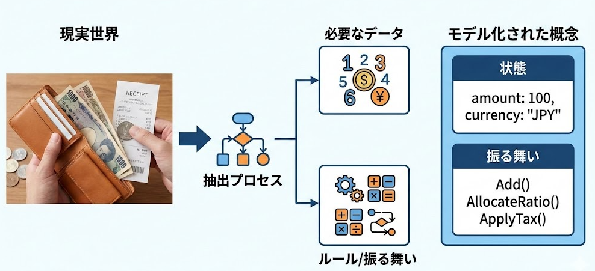

---

# モデルの持つルール

### 持つべき**状態**
- amount: 100
- currency: "JPY"

### 持つべき**ルール**（振る舞い）
- Add(Money other)：同じ通貨だけ足せる
- AllocateRatio(%)：割り勘のときの端数処理規則（1円未満切り捨て等）
- ApplyTax(rate)：税計算の丸め（四捨五入/切り上げなど）を含む

---
<div class="midium">

# モデルが**振る舞い**を持つ<br> ＝ その概念の“取り扱い説明書”をモデルの**内側**に埋め込むこと<br>→ 常にそのルールが守られる
### **貧血**ドメインモデル<br>＝ 状態だけ を取り出して、意味と操作（＝世界のルール）をモデルの**外に**捨ててしまう状態<br>→ だから**アンチパターン**
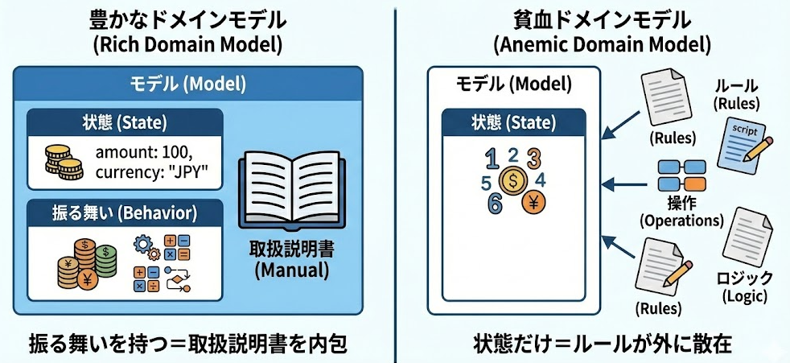

---

### プリミティブ型に固執し、振る舞いを持たないモデルのデメリット

<div class="small">

### BAD①：意味が読み取れないロジック

```csharp
// 120って何？単位は？どの業務領域の制約？
if ((placedAt - shippedAt) > 120) throw new Exception("NG");
```
### BAD②：あちこちに散らばった業務知識

```csharp
// Controller 
const int LimitMinutes = 120
// API POST: 120分チェック
if ((placedAt - shippedAt) > LimitMinutes) return BadRequest();
・・・

// API PUT: 120分チェック
if ((placedAt - shippedAt) > LimitMinutes) return BadRequest();
・・・

// API PATCH: 120分チェック
if ((placedAt - shippedAt) > LimitMinutes) return BadRequest();
・・・

// BATCH
const int LimitMinutes = 120
status = (placedAt - shippedAt) <= LimitMinutes? "OK" : "NG";
・・・
```
</div>

### →こうなるとドキュメントで業務知識を補完するしかなくなる

---

# ドメインモデルの戦術

### どう実装する?
- 複雑で独自性の高い分野はどのように実装すべきか → ドメインモデル
- ドメインモデルは、モデルに振る舞いを持たせるためのさまざまな業務領域の知見（戦術）を持つ
- しかし、ドメインモデルの戦術パターンには難解な内容も多い・・・
(集約・値オブジェクト・CQRS・イベントソーシング...)
## まずは、いつでも使える**値オブジェクト**から始めよう

---

# 値オブジェクトを使って、<br>エンティティに**振る舞い**を持たせる

---

# 値オブジェクトの原則
**識別子を持たず**、**値そのものに意味があり**、**不変である**
ことを前提に扱うオブジェクト
  - **交換可能性**：1000円という値は、どの1000円札でも良い
    → 識別子（ID）を持たない
  - **同一性**：ある1000円札と、他の1000円札はイコールであるとみなせる
    → 参照比較ではなく値の比較
  - **不変性**：1000円から100円引くときに、1000円札そのものを変更せず、
  900円を新たに作り出す
  → Immutableなインスタンスにする

# C#の場合：**record** classで実装すれば原則を満たす

---

### 値オブジェクトを使うことで解決されること
<div class="small">

1. その値に名前を与えることができる（意図の明確化）
2. 取り違え防止（型の機能を使える）
3. その値に振る舞いを持たせることができる
</div>
<div class="small">

### GOOD：コードから業務知識が読み取れる

```csharp

// 利用箇所
var time = TransportTime.From(shippedAt, placedAt); // 120分超ならここで失敗（仕様が型にある）

// 定義
public sealed record class TransportTime
{
    public int Minutes { get; private set; }
    public const int LimitMinutes = 120;

    private TransportTime() { } // EF用

    private TransportTime(int minutes)
    {
            // ルールは一か所に凝集する
        if (minutes < 0) throw new ArgumentOutOfRangeException(nameof(minutes));
        if (minutes > LimitMinutes) throw new InvalidOperationException($"運搬時間は{LimitMinutes}分以内。");
        // もし夏季は90分以内で運搬する、というルールが発生した場合、このクラスにまとめる
        Minutes = minutes; // 常に不正ではない値だけが初期化される
    }

    public static TransportTime From(DateTime shippedAt, DateTime placedAt)
        => new((int)Math.Ceiling((placedAt - shippedAt).TotalMinutes));
}
```
</div>

--- 

- Q1：このような状態をなんという？
    - 高凝集
- 値オブジェクトを利用することで凝集度を高くすることができる
    - 逆にチェックロジックがあちこちに散らばっている状態を低凝集という

---

<div class="columns" >
<div class="midium">

# static固執のデメリット
## ？「一か所にチェックロジックをまとめたいなら、staticな値Helper（値Util）クラスじゃダメなの？」

## ①：メソッド化しても、呼びだされなければ意味が無いので、リスクは残る
## ②：そのロジックが複雑に絡み合い、どんどん複雑化する可能性
  - 凝集レベルでいうと論理的凝集に当たり、
  7つの凝集度の中で下から２番目

</div>
<div class="midium">

``` csharp
public static class ConcretePlacementHelper
{
    public static void Post(
        ConcretePlacementDto dto,
        ConcreteDbContext db)
    {
        Validate(dto);

        EnsureWithinAllowedTime(dto);

        var entity = new ConcretePlacement
        {
            DeliveryTime = dto.DeliveryTime,
            PlacementTime = dto.PlacementTime,
            Volume = dto.Volume
        };

        db.ConcretePlacements.Add(entity);
        db.SaveChanges();
    }

    // RESTの公開メソッド群
    // PUT GET など

    // ---- 以下、ドメインロジック ----

    private static void Validate(ConcretePlacementDto dto)
    {
        if (dto.Volume <= 0)
        {
            throw new InvalidOperationException("数量は正の値である必要があります");
        }
    }

    private static void EnsureWithinAllowedTime(ConcretePlacementDto dto)
    {
        var duration = dto.PlacementTime - dto.DeliveryTime;

        if (duration > TimeSpan.FromHours(2))
        {
            throw new InvalidOperationException("打設時間超過です");
        }
    }
}
```

</div>
</div>

---

### BAD①：呼び忘れる

```csharp
public static class DeliveryRules
{
    public static void EnsureWithin120(DateTime shippedAt, DateTime placedAt)
    {
        if ((placedAt - shippedAt).TotalMinutes > 120)
            throw new InvalidOperationException("運搬時間NG");
    }
}

// API PUT: ちゃんと呼ぶ
DeliveryRules.EnsureWithin120(e.ShippedAt, placedAt);
e.TransportMinutes = (int)(placedAt - e.ShippedAt).TotalMinutes;

// API POST: 呼び忘れてもコンパイルは通る（事故が起きる）
e.TransportMinutes = (int)(placedAt - e.ShippedAt).TotalMinutes;
```

---

### BAD②：論理的凝集に陥る

```csharp
public static class DeliveryRules
{
    public static void EnsureWithin120(...) { ... }
    public static void EnsurePhotoCount(...) { ... }
    public static void EnsureCustomerException(...) { ... }
    // “配送”に関するものが何でも入る
}
```

- どのルールがどのモデルのためのものなのか明確ではない
- 同じクラスに置かれていることで、switchでの分岐やif elseの増加につながる

---

##  Q：どちらが複雑？：値オブジェクトで書かれたロジック

<div class="columns" >
<div class="midium">

### BAD：3つの自由な値

```csharp
public sealed record class DeliveryBad
{
    public DateTime ShippedAt { get; init; }
    public DateTime PlacedAt  { get; init; }
    public int ElapsedMinutes { get; init; } // ←自由な値

    public bool IsWithin120()
        => ElapsedMinutes <= 120; 
}

var bad = new DeliveryBad
{
    ShippedAt = new DateTime(2025, 12, 16,  9,  0, 0),
    PlacedAt  = new DateTime(2025, 12, 16, 12,  0, 0),//180分
    ElapsedMinutes = 120　// （嘘の状態）
    // 時間差は180分なのに ElapsedMinutes=120 が入ってしまう

};
```
</div>
<div class="midium">

### GOOD：2つの値と１つの計算される値

```csharp
public sealed record class ConcreteDelivery
{
    public DateTime ShippedAt { get; }
    public DateTime PlacedAt  { get; }
    // “かかった時間”は状態として持たない。常に計算される。
    public TimeSpan TransportDuration => PlacedAt - ShippedAt;

    public ConcreteDelivery(DateTime shippedAt, DateTime placedAt)
    {
        if (placedAt < shippedAt) 
            throw new ArgumentException
                ("打設時刻は出荷時刻以降である必要があります");
        ShippedAt = shippedAt;
        PlacedAt  = placedAt;

        if (TransportDuration > TimeSpan.FromMinutes(120))
            throw new InvalidOperationException
                ("運搬時間は120分以内でなければなりません");
    }
}

// 利用例（不正値を生成しようとすると例外発生）
var delivery = new ConcreteDelivery(
    shippedAt: new DateTime(2025, 12, 16,  9,  0, 0),
    placedAt:  new DateTime(2025, 12, 16, 10, 10, 0)
);

```

</div>
</div>


---

- 内部状態に関するすべてのロジックを値オブジェクトの中に記述する
- 値の自由度を下げ、複雑さを低減する
    - この考え方は、Reactにおいて計算によってStateをできるだけ減らそうという教えと同じ
    - 姓・名がある場合にはフルネームは不要…みたいな

---

# EFCoreで表現する値オブジェクト

## 翻って、EFCoreとは何だったか

DBの都合を隠蔽し、文字列のSQLではなく「オブジェクト」を中心とするもの
  - オブジェクト中心であることで、レコード同士の関連を表現しやすくなる
  - (**New**)オブジェクト中心であることで、複雑な「**業務ロジック**」を
  **値オブジェクトの振る舞い**として表現し、カプセル化できる

## **中核的領域**では、業務ロジックは「本質的に複雑」であるため、オブジェクトを中心にすることのメリットが大きい
  
--- 

<div class="columns" >
<div class="midium">

# 貧血ドメインモデル

**ただEFCoreを使うだけ**だと、トランザクションスクリプトとアクティブレコードの**悪いとこ取り**になる

``` csharp
public class ConcretePlacement
{
    public int Id { get; set; }

    public DateTime DeliveryTime { get; set; }
    public DateTime PlacementTime { get; set; }
    public decimal Volume { get; set; }
}
```
- 振る舞いを持たないエンティティ
（貧血ドメインモデル）を使って、
**トランザクションスクリプト**で業務ロジックを記述する
- 業務の都合ではなく、RDB（永続化）の都合で実装する
- しかもSQLは隠蔽されていて記法に注意が必要

# 業務が複雑になるとカオスになる

</div>
<div>

``` csharp
public static class ConcretePlacementHelper
{
    public static void Post(
        ConcretePlacementDto dto,
        ConcreteDbContext db)
    {
        Validate(dto);

        EnsureWithinAllowedTime(dto);

        var entity = new ConcretePlacement
        {
            DeliveryTime = dto.DeliveryTime,
            PlacementTime = dto.PlacementTime,
            Volume = dto.Volume
        };

        db.ConcretePlacements.Add(entity);
        db.SaveChanges();
    }

    // RESTの公開メソッド群
    // PUT GET など

    // ---- 以下、ドメインロジック ----

    private static void Validate(ConcretePlacementDto dto)
    {
        if (dto.Volume <= 0)
        {
            throw new InvalidOperationException("数量は正の値である必要があります");
        }
    }

    private static void EnsureWithinAllowedTime(ConcretePlacementDto dto)
    {
        var duration = dto.PlacementTime - dto.DeliveryTime;

        if (duration > TimeSpan.FromHours(2))
        {
            throw new InvalidOperationException("打設時間超過です");
        }
    }
}
```

</div>
</div>


---

# **Complex Type**とFluent APIで<br>値オブジェクトをDBカラムに紐づける

- モデル（値オブジェクト含む）はPOCOである必要があり、
フレームワーク（EFCore）に依存させてはいけない
    - EFCoreに依存させると、結局DBの複雑性を持ち込ませることになるから
- POCOの値オブジェクトをどうやってEFCoreに紐づけるのか？ 

### Mapperの独自実装が必要？→その必要は**無い**

---


### Step1 POCOで値オブジェクトを書く
```csharp
public sealed record class TransportTime
{
    public int Minutes { get; private set; }
    public const int LimitMinutes = 120;

    private TransportTime() { } // EF用おまじない

    private TransportTime(int minutes)
    {
        // ルールは一か所に凝集する
        if (minutes < 0) throw new ArgumentOutOfRangeException(nameof(minutes));
        if (minutes > LimitMinutes) throw new InvalidOperationException($"運搬時間は{LimitMinutes}分以内。");
        // もし夏季は90分以内で運搬する、というルールが発生した場合、このクラスにまとめる
        Minutes = minutes; // 常に不正ではない値だけが初期化される
    }

    public static TransportTime From(DateTime shippedAt, DateTime placedAt)
        => new((int)Math.Ceiling((placedAt - shippedAt).TotalMinutes));
}
```
- おまじないはあるが、EFCoreへのパッケージ依存はしていない

---

### Step2 Complex TypeとしてFluent APIでDBに結び付ける
- コンクリートの配送(ConcreteDelivery)というエンティティの中に、
    配送時間(TranceportTime)がある場合の例
```csharp
// DbContext
modelBuilder.Entity<ConcreteDelivery>()
    .ComplexProperty(x => x.TransportTime, ct =>
        ct.Property(p => p.Minutes).HasColumnName("TransportMinutes"));
```
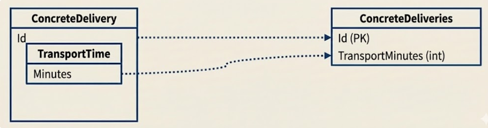


---

- 注意点：ListのComplex Typesはサポートされていない

```csharp
List<TransportTime> TrancsportTimes // これはそのままだとテーブルに紐づけられない
```

- なぜか…？

---

### 値オブジェクトとエンティティ

|値オブジェクト|↔|エンティティ|
|----|-|----|
|不変|↔|可変|
|IDが無い|↔|IDがある|
- 値オブジェクトは、**値が一緒であれば、同じものである**とみなす
- エンティティの一部として値オブジェクトがある
    - Complex TypesがListをサポートしていないことについて困った場合、
    それは値オブジェクトではなく、エンティティかも

---

```csharp
public class ConcreteDelivery // Aggregate Root(Entity)
{
    public Guid Id { get; private set; }
    public DateTime ShippedAt { get; private set; }

    // これはエンティティ
    public List<TransportCheckpoint> Checkpoints { get; private set; } = new();

    private ConcreteDelivery() { } // EF

    public void MarkPlaced(DateTime placedAt)
    {
        CurrentTransportTime = TransportTime.From(ShippedAt, placedAt); // ルールはVOに集約
        AddCheckpoint(placedAt);
    }

    public void AddCheckpoint(string kind, DateTime at)
    {
        var t = TransportTime.From(ShippedAt, at); // 120分ルール
        Checkpoints.Add(TransportCheckpoint.New(kind, at, t));
    }
}

public class TransportCheckpoint // Entity (履歴の1件)
{
    public Guid Id { get; private set; }   // ←識別子がある（つまりエンティティ）
    public Guid DeliveryId { get; private set; }
    public DateTime RecordedAt { get; private set; }
    public TransportTime TransportTime { get; private set; } = default!; // ここに値オブジェクトが現れる

    private TransportCheckpoint() { } // EF
    private TransportCheckpoint(Guid id, Guid deliveryId, DateTime at, TransportTime t)
        => (Id, DeliveryId, RecordedAt, TransportTime) = (id, deliveryId, at, t);

    public static TransportCheckpoint New(string kind, DateTime at, TransportTime t)
        => new(Guid.NewGuid(), Guid.Empty, at, t);
}

```

---

### OwnsManyを利用して、中間テーブルを値オブジェクトとみなす

- どうしても値オブジェクトのリストを持つべきだと思われるとき
    - Listの中身が重複せず、値が同じなら同じものであるとみなせるもの
    - 中間テーブルを介してマスタを参照するようなテーブル構造のもの
- 例えば：記事に対するタグ、エンジニアに対する資格一覧、工事に対する所属者IDなど
    - 「エンジニア」が持つ「資格」の例
    - IDという値を持つ値オブジェクトだと考えられる

---

<div class="columns" >
<div class="midium">

エンティティ
```csharp
public readonly record struct QualificationId(string Value);

public sealed class Engineer
{
    public Guid Id { get; private set; }

    private readonly List<EngineerQualification> _qualifications = new();
    public IReadOnlyCollection<EngineerQualification> Qualifications => _qualifications;

    private Engineer() { } // EF

    public Engineer(Guid id) => Id = id;

    public void AddQualification(QualificationId qualificationId)
    {
        if (_qualifications.Any(x => x.QualificationId == qualificationId)) return;
        _qualifications.Add(new EngineerQualification(qualificationId));
    }

    public void RemoveQualification(QualificationId qualificationId)
        => _qualifications.RemoveAll(x => x.QualificationId == qualificationId);
}
```

紐づきを表現する値オブジェクト

``` csharp
// “エンジニアと資格の紐づき”だけを表す値オブジェクト（追加情報なしの中間テーブル）
public sealed record class EngineerQualification
{
    public QualificationId QualificationId { get; private set; }

    private EngineerQualification() { } // EF
    public EngineerQualification(QualificationId qualificationId) => QualificationId = qualificationId;
}

// 資格情報マスタ
public sealed class QualificationMaster
{
    public string Id { get; private set; } = default!; // 例: "基本情報", "応用情報"
    public string Name { get; private set; } = default!;
}

```

</div>
<div class="midium">
    
DbContextの定義

```csharp
using Microsoft.EntityFrameworkCore;

protected override void OnModelCreating(ModelBuilder modelBuilder)
{
    modelBuilder.Entity<Engineer>(b =>
    {
        b.HasKey(x => x.Id);

        b.OwnsMany(x => x.Qualifications, q =>
        {
            q.ToTable("EngineerQualifications");      // ← 中間テーブル
            q.WithOwner().HasForeignKey("EngineerId");

            // 値オブジェクトの中身を1列にマップ
            q.OwnsOne(x => x.QualificationId, id =>
            {
                id.Property(p => p.Value)
                    .HasColumnName("QualificationId")
                    .IsRequired();
            });

            // 中間テーブルなので複合キーにする（永続化上のキーであって、ドメインIDではない）
            q.HasKey("EngineerId", "QualificationId");

            // 同一エンジニア内での重複防止にもなる
        });
    });

    modelBuilder.Entity<QualificationMaster>(b =>
    {
        b.ToTable("QualificationMasters");
        b.HasKey(x => x.Id);
    });
}

```
</div>
</div>

---
    
DB上はエンティティであるものをOwned Manyを用いて値オブジェクトとして定義可能
- この値オブジェクトに振る舞いを持たせることはあまりないかもしれないが…
    - 他のプロパティが値オブジェクトになっているときに一貫性が出る
    - 集約的にうれしい（集約ルートからしか制御させない、トランザクションの境界）

---

## 値オブジェクトを利用するときの注意点

### 良い名前を付ける
- 良い名前とは・・・？
- ドメイン駆動設計は**業務**の複雑さに向き合うものである
    - 業務エキスパートと**同じ言葉**を使う（ユビキタス言語）
### 同じ言葉（ユビキタス言語）
- 業務エキスパートと、開発と、電話サポートと・・・
すべての関係者が**同じ言葉**を使ってコミュニケーションできるようにする
- フロントエンドとバックエンドでもできる同じ言葉を使うようにする

---

### 文脈を区切る（Bounded Context）
 別のものを同じにしてはいけない
- 文脈によって意味が変わるものは別のものである
    - この時はこのルール、この時はこのルールとすると
    結局密結合・低凝集（論理的凝集）
    
### BAD：違うものを同じところに押し込める

<div class="midium">

```csharp
public enum EmailUsage { Billing, Community }

public sealed record Email(string Value, EmailUsage Usage)
{
    public static Email Create(string value, EmailUsage usage)
    {
        // “メールアドレス”という同じ言葉に、文脈の差分を押し込めている
        return usage switch
        {
            EmailUsage.Billing   => value.EndsWith("@company.com") ? new(value, usage) : throw new Exception("請求文脈の制約NG"),
            EmailUsage.Community => !value.EndsWith("@company.com") ? new(value, usage) : throw new Exception("コミュニティ文脈の制約NG"),
            _ => throw new NotSupportedException()
        };
    }
}

```
</div>

---

### GOOD：区切られた文脈によって、モジュールを分割する

<div class="midium">

```csharp
namespace Billing; // 請求（Billing）という区切られた文脈

public sealed record Email(string Value)
{
    public static Email Create(string value)
        => value.EndsWith("@company.com")
            ? new(value)
            : throw new Exception("請求文脈：社用ドメイン必須");
}
```

```csharp
namespace Community; // コミュニティという区切られた文脈

public sealed record Email(string Value)
{
    public static Email Create(string value)
        => !value.EndsWith("@company.com")
            ? new(value)
            : throw new Exception("コミュニティ文脈：社用ドメイン禁止");
}

```
</div>

--- 

### 注意：形容詞をつけて区別すると、同じ言葉ではなくなる
- 業務エキスパートは、いちいち「請求の」「コミュニティの」アドレスと言うか？

### Warning：形容詞で区別してしまう

<div class="midium">

```csharp
public sealed record BillingEmail(string Value)
{
    public static BillingEmail Create(string value)
        => value.EndsWith("@company.com")
            ? new(value)
            : throw new Exception("請求先は社用メール必須");
}

public sealed record CommunityEmail(string Value)
{
    public static CommunityEmail Create(string value)
        => !value.EndsWith("@company.com")
            ? new(value)
            : throw new Exception("コミュニティは社用メール禁止");
}

```
</div>

---
## 値オブジェクトまとめ

- プリミティブ型に固執せず、**名前**と**振る舞い**を与え、
エンティティを業務領域を表現する概念（**モデル**）として表現する
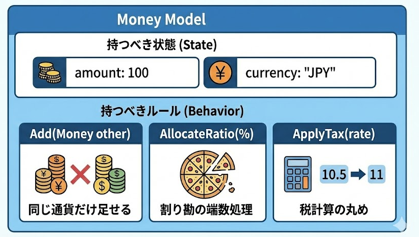

---

# ドメインモデルについての率直な感想
- ファイルが増えて追いずらそう、めんどい、やったことない、
- 学習コストがかかる・・・
- モデルに対する哲学的議論より手を動かしたい

---

## ドメインモデルは**どこでも使えばいいってものではない**
- ただしアーキテクチャの選択について理由を明確にするべき
- 同じアプリケーション内で、機能(区切られた文脈)ごとに変えてもよい
  - CQRS観点でQuery（読み取り側）だけアクティブレコードにしてもよい
  


---
## ドメインモデルをいつやるか
- 今その必要がないからと言って、ずっとその必要がないとは限りません
  
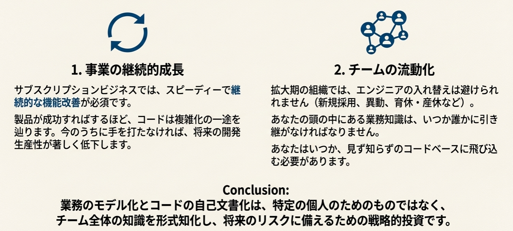

---

# プロのキッチンを整える

### 業務ロジックが凝集され、カオスにならないコードベース
  - 美しいまな板のようなもの
### 業務エキスパートと深く相互理解された洗練されたユビキタス言語
### それらが生み出す役に立つ（業務ロジックを雄弁に語ることができる）モデル
  - 切れ味のいい包丁のようなもの

# これらが整うことで、いつでも新しく魅力的な料理（機能）を産み出すことができる

--- 
# 貧血ドメインモデル
- ただEFCoreを使うだけだと、
モデルは振る舞いを持たず、処理が手続き的で業務知識を表現しない
- 最初はシンプルな機能でも、改修を繰り返すうちに、徐々にコードが汚れる
  
### 汚れたまな板とさびた包丁で料理するようなことになっていく
  - どんなに料理人（エンジニア）の腕が良くても、
  スピード（生産性）が落ち、
  出来上がる料理（機能）の品質は低下する

---

# まとめ

- **自己文書化**された、業務知識を雄弁に語るコードにより
    - 辛い仕事を回避し、スピーディーな開発生産性を**維持**できる
- **中核的領域**で**業務そのものの複雑さに向き合う**ときに**ドメインモデル**を実践する
    - 模倣困難性の高い機能（価値）を産み出すために、中核的領域に注力する
- **ドメインモデル**の実践により、POCOで**業務ロジック**を記述することに集中できる
    - 永続化ではなく、**業務ロジックこそがアプリケーション**である
- EFCoreを利用しているのは、DBの情報を**オブジェクト**として表現し、
  - さらに**値オブジェクト**などを利用して**モデルに振る舞い**を持たせ、
  複雑さに向き合うための**役に立つモデル**を磨いていくためである
## まずは、**値オブジェクト**を使っていこう